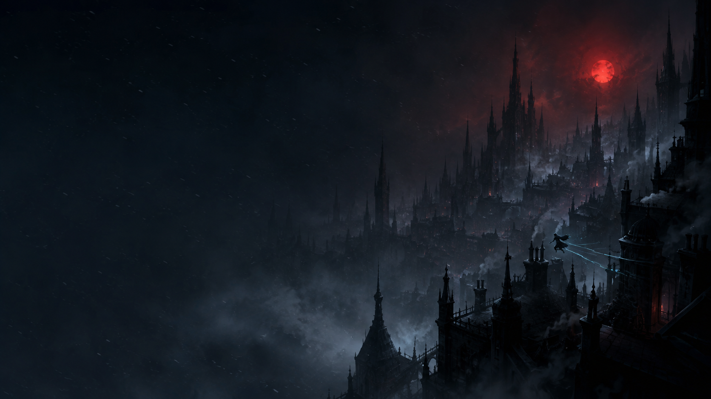

# Cosmere Investiture for Omarchy

A dark, translucent Omarchy theme inspired by the worlds and magic systems of
Brandon Sanderson's Cosmere. Stormlight cyan leads the palette, with Roshar
violet, Scadrial ember, and metallic gold as supporting colors.



## Install

Install papirus icon theme (not part of base Omarchy install):

```sh
omarchy pkg add papirus-icon-theme
```

Then install the theme:

```sh
omarchy theme install https://github.com/mcsmith3/omarchy-cosmere-investiture-theme
```

Then select **Cosmere Investiture** from Omarchy's theme menu, or run:

```sh
omarchy theme set cosmere-investiture
```

Cycle through the included wallpapers with:

```sh
omarchy theme bg next
```

## Included

- Deep navy palette with cyan, violet, ember, and gold accents
- Translucent Omarchy bar, launcher, menus, popups, and notifications
- Matching icon-theme preference (Papirus-Dark)
- Ten original 1672×941 wallpapers inspired by Stormlight, Mistborn,
  Elantris, Warbreaker, Tress of the Emerald Sea, and The Sunlit Man

## Wallpapers

1. Highstorm
2. Ash and Metal
3. Cognitive Realm
4. Mistborn: Final Empire
5. Mistborn: Wax and Wayne
6. Elantris
7. Warbreaker
8. Tress of the Emerald Sea
9. The Sunlit Man
10. Omarchy Investiture

## Notes

This is an unofficial fan-made theme. It is not affiliated with or endorsed
by Brandon Sanderson, Dragonsteel Entertainment, Tor Books, or Omarchy.
All included wallpapers are original AI-generated artwork created for this
theme; no official book-cover artwork or supplied source images are included.

Omarchy regenerates executable theme files when installing Git-backed themes,
so this repository intentionally uses the supported declarative theme files.

## License

Released under the [MIT License](LICENSE).

